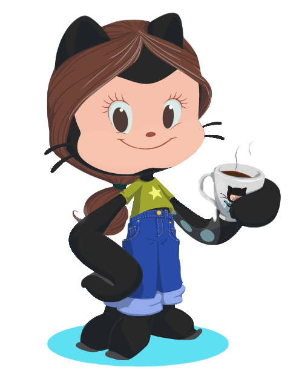

### < Olá, eu sou a Ligia! 👋 >

  

    Estou em transição de carreira, atualmente estudo Desenvolvimento Web na <a href="https://www.betrybe.com/" target="_blank">Trybe</a>.
  

  

    👩‍💻 Estudando Node.js  
    🨠Meus hobbies são séries, livros e bordados  
    💬 Vamos conversar? Me chama pra um café!  
    
  

  

##

  <!-- light mode -->
  

    <a href="https://github.com/ligia-arcanjo#gh-light-mode-only">
      
      
      <!--   -->
    </a>
  

  
  <!-- dark mode -->
  

    <a href="https://github.com/ligia-arcanjo#gh-dark-mode-only">
      
      
      <!--  -->
    </a>
  

<h4 align="center"> Linguagens e ferramentas </h4>

 
  
  
  
  
  
  
  

##

   
  

